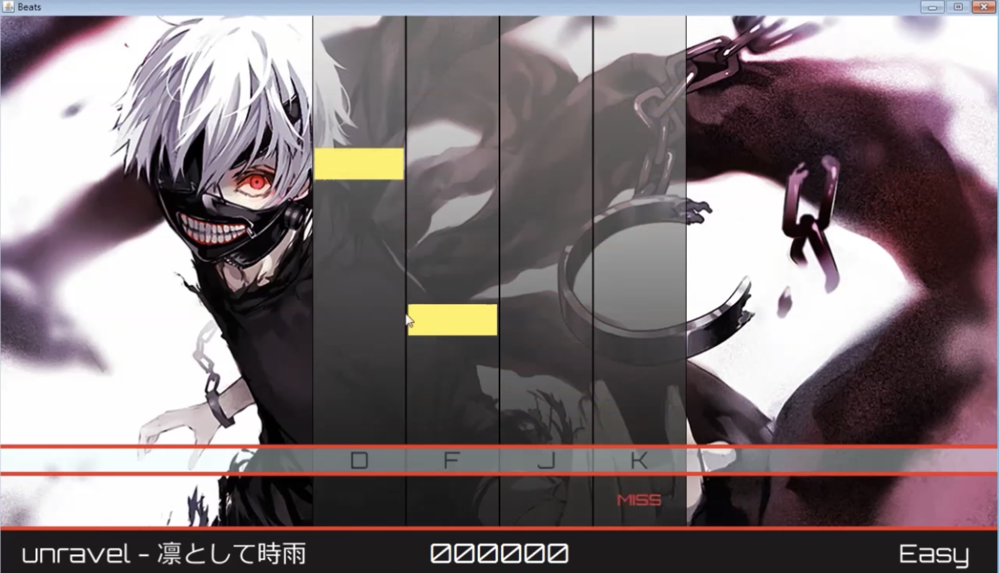

title: Music/Rhythm Game Design

## 1. Key Techniques

### 1) Drop-down beat match up with music beat.

There are two options:
a.Using create mode in unity
https://www.youtube.com/watch?v=u9XNvh-Vufk

b.Using Koreography package
https://www.youtube.com/watch?v=uNi0Ssuww9w
### 2) Voice control
Using volume
https://www.bilibili.com/video/av10477604?p=2

### 3)Keyboard control to touch-screen control
Touch input, split the screen for sections.
### 4) Score system
Perfect, good, miss

## 2.Scene

### 1) Main scene.
For game playing.

### 2) Intro/game-begin scene.
Before the game starts. How-to-play introduction (optional). Better contain background music.

### 3) Win scene.
When player wins the game. Better contain background music

### 4) Lost scene.
When player lost the game (if we design a life mode).

## 3.UI

For reference only, https://www.youtube.com/watch?v=0Q27u7pq0Co&t=188s

### 1) Intro

A start button

other information like game introduction(how to play the game), designer, etc.
with background music


### 2) Choosing game level

Easy, middle, hard

with background music


### 3) Song list

Song1, song2, …


### 4) Main scene

with score, streak, multi, life bar, etc.

make voice-control note a little bit larger (or longer) than common note, and pop up text to remind player to use voice control when a voice note fall down.


### 5) Win/lost scene

- Total score
-
Total Perfect hit
- Total Good hit
- Total Miss hit
- Try-again button
- 
Exit button
